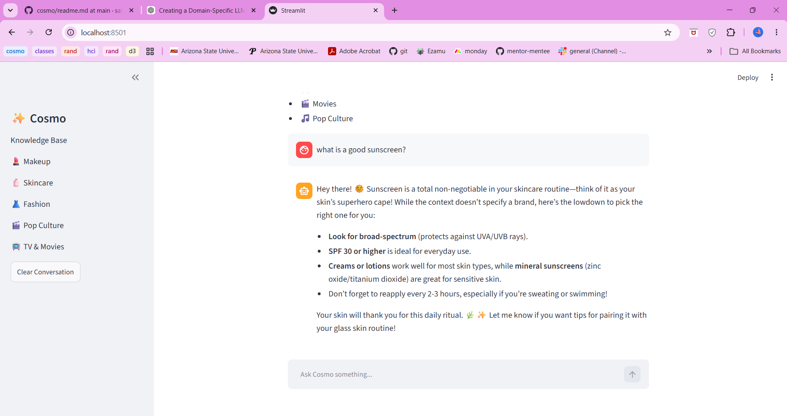
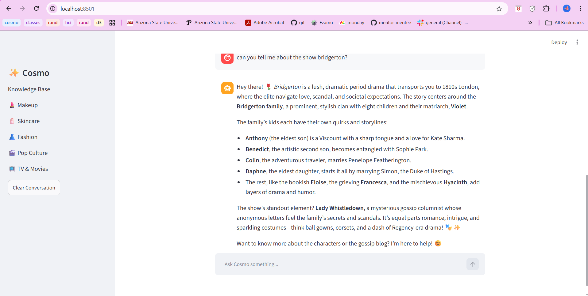

Cosmo: 

Cosmo is a personal AI assistant project focused on:

- Beauty
- Skincare
- Cosmetics
- Fashion
- Pop Culture
- Sports

Current Features
- Local LLM using Ollama
- Qwen3 model integration
- Python command-line chat interface
- Retrieval-Augmented Generation (RAG)
- Streamlit for web application
- Beauty knowledge base
- Pop culture knowledge base
- Fashion trends
- Celebrity information

Future Goals
- Beauty knowledge base
- Celebrity style recommendations
- Product recommendations

Images: 
Prompts outside of knowledge base: 

Prompts within knowledge base: 
